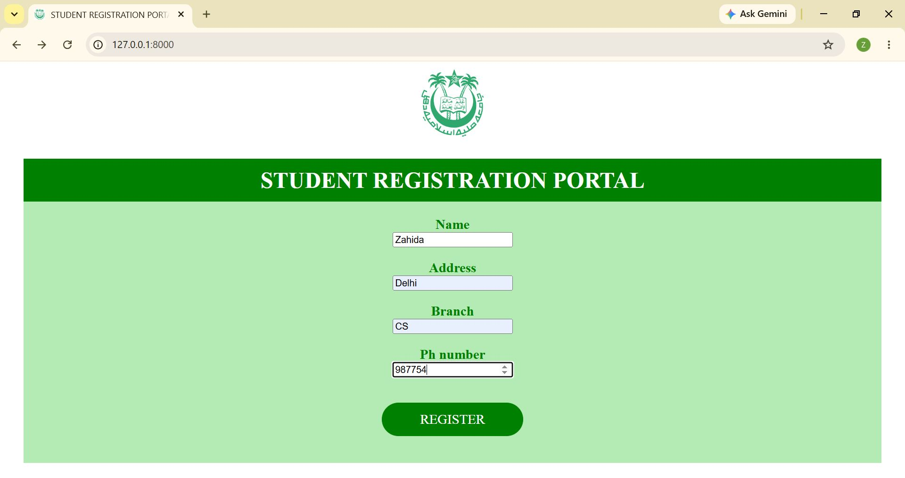
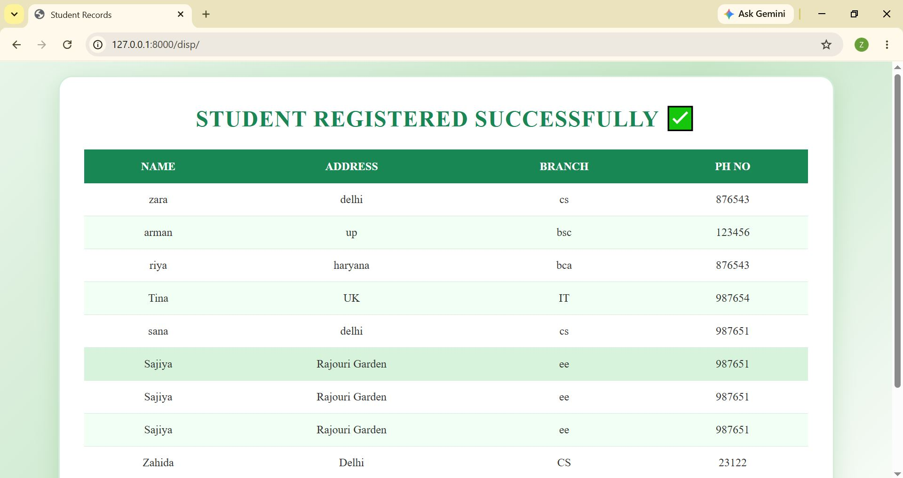
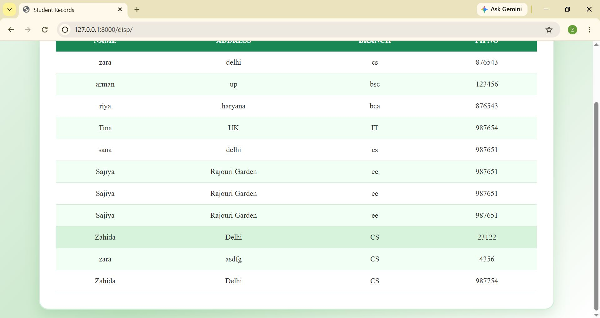

# Student Registration Portal

A Django-based Student Registration Portal developed using Python, Django, HTML, CSS, and SQLite. The application allows users to register student information through a form and view submitted student records in a structured table format.

## Project Overview

The Student Registration Portal is designed to collect and manage student information efficiently. Users can submit student details through a registration form, and all submitted records are stored in the database and displayed in a tabular format. The project demonstrates Django form handling, database integration, template rendering, and data management.

## Features

- Student Registration Form
- Store Student Information in Database
- Display Registered Students
- Success Confirmation Page
- SQLite Database Integration
- User-Friendly Interface
- Dynamic Data Management using Django

## Technologies Used

- Python
- Django
- SQLite
- HTML
- CSS

## Screenshots

### Home Page



### Display Page 1



### Display Page 2


## How to Run the Project

### 1. Clone the Repository

```bash
git clone https://github.com/zahidacodes/student-registration-portal.git
```

### 2. Navigate to the Project Directory

```bash
cd student-registration-portal
```

### 3. Install Django

```bash
pip install django
```

### 4. Run the Development Server

```bash
python manage.py runserver
```

### 5. Open the Application

Open your browser and visit:

```text
http://127.0.0.1:8000/
```

## Database

This repository includes the `db.sqlite3` database file with sample student records for demonstration purposes.

## Application Workflow

### Student Registration

Users can fill out the registration form with student information.

### Data Storage

Submitted information is stored in the SQLite database.

### Record Display

All registered student records are displayed in a structured table.

### Success Confirmation

After successful submission, users are redirected to a confirmation page.

## Project Structure

```text
student-registration-portal/
│
├── manage.py
├── db.sqlite3
├── templates/
├── static/
├── ProjectScreenshots/
├── app/
├── project/
└── README.md
```

## Future Improvements

- Search Functionality
- Edit Student Records
- Delete Student Records
- User Authentication
- Export Data to Excel/PDF

## Author

Zahida
